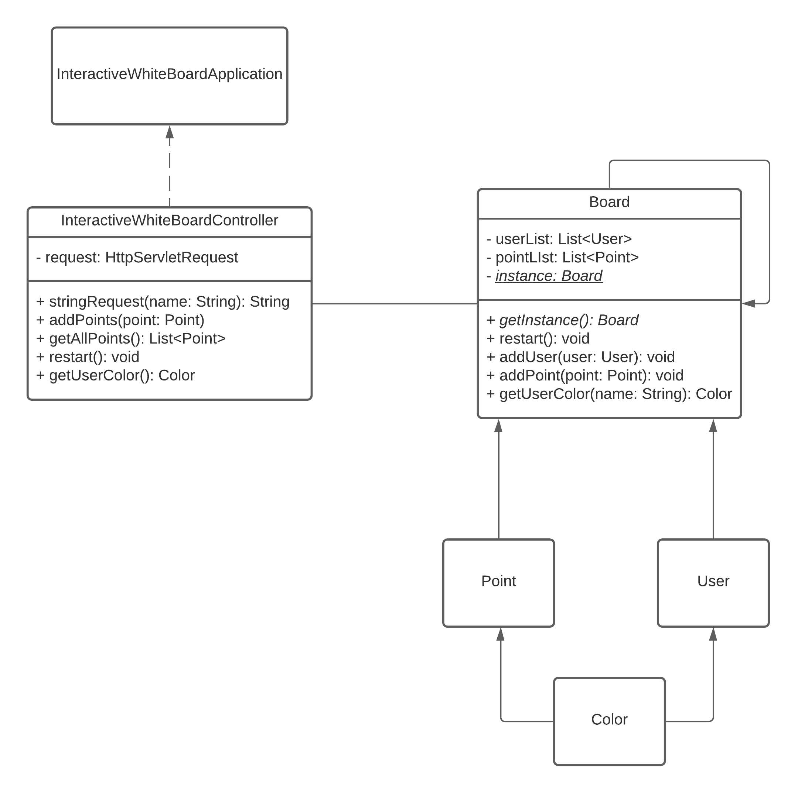
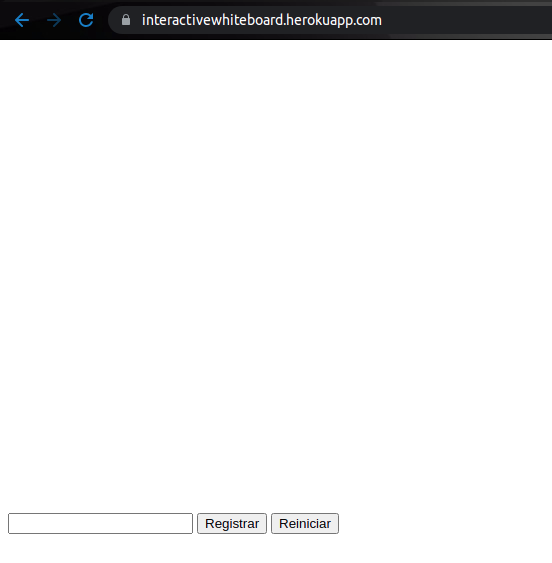
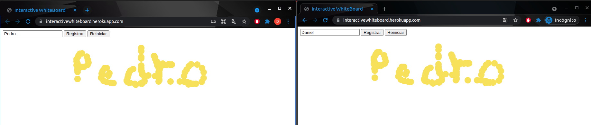
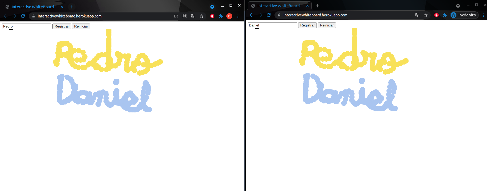
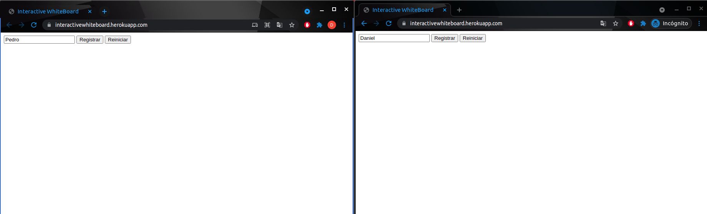

# Interactive WhiteBoard
Aplicación que utiliza la nube de Heroku para desplegar un tablero interactivo, en donde, varias personas podrán registrarse y ver en tiempo real los dibujos de las personas registradas.

## Instrucciones de uso
### Prerrequisitos
* Git version 2.25.1
* Apache Maven version: 3.6.3
* Java versión: 1.8.0
### Ejecución
Para poder usar el proyecto desde tu maquina local debes clonar el proyecto subido en Github utilizando el siguiente comando desde una terminar que cuente con Git:
```
git clone https://github.com/Desarik98/InteractiveWhiteBoard.git
```

Luego de clonar el proyecto, por medio de la terminal se debe ejecutar el siguiente comando para generar las dependencias necesarias y poder ejecutar el proyecto, para esto es necesario tener instalado **Maven**
```
mvn package
```
A continuación, para ejecutar el programa se debe ejecutar el siguiente comando desde la terminal en el directorio del proyecto clonado

**Linux**
```
java -cp "target/classes:target/dependency/*" edu.escuelaing.arsw.interactivewhiteboard.InteractiveWhiteBoardApplication
```
**Windows**
```
java -cp "target/classes;target/dependency/*" edu.escuelaing.arsw.interactivewhiteboard.InteractiveWhiteBoardApplication
```

## Diagrama de clases

* **InteractiveWhiteBoardController:** Controlador que por medio de Springboot se encarga del manejo de las peticiones GET y POST que se obtengan mediante la pagina web.
* **Board:** Clase en la cual se obtienen todos los puntos dibujados por todos los usuarios y los usuarios que se encuentren registrados.
* **Point:** Clase en la cual se obtienen los datos especificos de cada uno de los puntos dibujados como su posicion en x, y y su color.
* **Color:** Clase en la cual se encuentran los datos **RGB** para utilizarlos y en conjunto crear un color.
* **User:** Clase en la cual se encuentran los datos como el nombre y el color que representa cada usuario.

## Pruebas de Usuario InteractiveWhiteBoard
Para comprobar el funcionamiento se debe ir al link [https://picasfamasarsw.herokuapp.com]() en donde se encontrará el siguiente Home Page:


Primero se deberá registrar con cualquier nombre con el que usted quiera ser representado y ya podrá dibujar con un color que lo representa. En este caso se tomo el nombre de Pedro y se dibujo en el tablero de Pedro



Para comprobar la funcionalidad y que efectivamente el dibujo de Pedro lo pueda ver otro usuario, se abrió una pestaña de incognito con el navegador que se este utilizando en este caso se utilizó Chrome y se registro con el nombre Daniel, y se dibujó en el tablero de Daniel. Como se puede observar en ambos lados se pueden ver los dibujos de ambos.



Para finalizar si una persona reinicia el tablero se le borrara a todos lo que se haya dibujado.


## Tecnologias
* Maven
* Java
* Springboot
* Heroku

## Autor
* Daniel Alejandro Mejía Rojas - Fecha: 24/06/2021

## Licencia
This project is licensed under the MIT License - see the LICENSE file for details